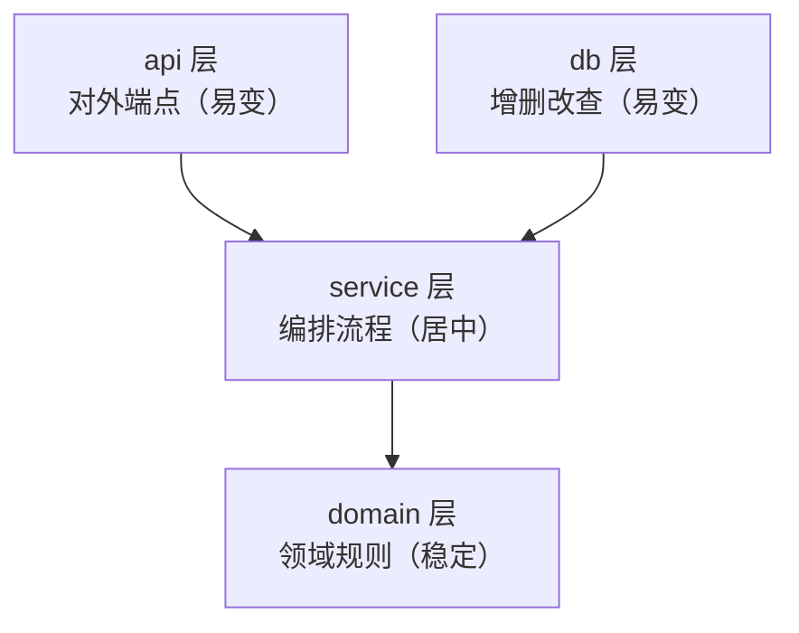

> **一句话核心**：架构设计的核心在于理清责任边界，并通过依赖倒置来降低变更风险。

DDD（**Domain-Driven Design**）强调以业务领域为核心来设计软件。下面用一个「课程报名」的用例，走一遍从「能跑但难维护」到四层架构的重构过程。

---

## 一、现有编程模式的痛点与重构必要性

当前许多开发流程过度依赖 AI 生成代码，但 AI 在设计能力上存在显著缺陷。让它实现一个课程报名的用例，得到的代码常常是这样：先从数据库里取数据，写几个 `if` 判断，根据判断结果抛出 HTTP 异常，或者把结果存储到数据库里。

```python
import sqlite3
from fastapi import FastAPI, Form, HTTPException

app = FastAPI()

@app.post("/enroll")
def enroll(student_id: str = Form(), course_id: str = Form()):
    # 连上数据库
    db = sqlite3.connect("school.db")
    # 查出这门课还剩多少名额
    cap = db.execute("SELECT capacity FROM courses WHERE id = ?",(course_id,)).fetchone()
    if cap is None:
        raise HTTPException(404, "课程不存在")
    # 名额满了就直接拒绝
    if cap[0] <= 0:
        raise HTTPException(400, "名额已满")
    # 查一下这个学生是不是已经报过这门课了
    row = db.execute("SELECT 1 FROM enrollments WHERE student_id = ? AND course_id = ?", (student_id, course_id)).fetchone()
    # 报过了也拒绝
    if row:
        raise HTTPException(400, "请勿重复报名")
    # 写入一条报名记录
    db.execute("INSERT INTO enrollments (student_id, course_id) VALUES (?, ?)", (student_id, course_id))
    # 课程余量减一
    db.execute("UPDATE courses SET capacity = capacity - 1 WHERE id = ?", (course_id,))
```

这段代码能跑，问题出在维护上：

- **难理解** — 想弄清业务流程，只能从 `if` 语句里反推业务到底是怎么规定的。
- **难测试** — 业务逻辑与数据库操作耦合，只想验证名额满了会不会报错，也得新建数据库连接。
- **难修改** — 想把数据库换掉（如从 SQLite 迁移到 PostgreSQL），就要修改大量语句。

因此，现代面试逐渐减少传统 LeetCode 考察，转而侧重架构设计能力；通过重构该用例，可以建立一套**好理解、好测试、好修改**的架构体系。

---

## 二、四层架构模型设计

第一步是理清这个用例存在哪些责任，再把它们拆开。为了清晰划分职责，我们将系统解耦为四个层级，遵循**易变层依赖不易变层**的原则，确保系统的可维护性。

### 1. 架构分层定义

| 层 | 职责 | 变化速度 |
| --- | --- | --- |
| **domain** | 领域规则：说明什么情况报名可以成功、什么情况会失败 | 稳定 |
| **service** | 编排流程：什么时候调用 db、什么时候调用领域规则 | 居中 |
| **api** | 对外接口：告诉前端要调用哪个 endpoint | 易变 |
| **db** | 操作数据库，即增删改查 | 易变 |

### 2. 依赖关系原则

api 和 db 属于容易变化的层，很可能某天想把 Web 框架或数据库换掉；domain 不容易变化，人满了就没法报名，这一点无论技术怎么变都不会变。

service 刚好在中间，没有 domain 那么固定，也没有 api 或 db 那么灵活。
于是得到一条依赖关系：**db 和 api 依赖 service，service 依赖 domain**。



> **核心原则**：高层模块不应该依赖低层模块，两者都应该依赖抽象；抽象不应该依赖细节，细节应该依赖抽象。

---

## 三、具体实现步骤与代码重构

在实际编码中，我们通过依赖倒置（Dependency Inversion）和依赖注入（Dependency Injection）来实现上述架构。以下是基于 Python 的重构方案。

### 1. Domain 层建模

领域层基本就是对现实世界建模。定义 `Student` 和 `Course` 对象，关键行为（如报名）封装在 `Course` 类内部。

```python
class CourseFullError(Exception): pass
class AlreadyEnrolledError(Exception): pass

class Student:
    def __init__(self, id, name):
        self.id = id
        self.name = name

class Course:
    def __init__(self, id, capacity, roster=None):
        self.id = id
        self.capacity = capacity
        self.roster = roster or []

    def enroll(self, student_id):
        # 检查容量限制
        if len(self.roster) >= self.capacity:
            raise CourseFullError("课程已满")
        # 检查是否已报名
        if any(s.id == student_id for s in self.roster):
            raise AlreadyEnrolledError("已经报名过")

        # 执行报名逻辑
        student = Student(student_id, "New Student")
        self.roster.append(student)
```

### 2. Service 层与抽象接口

Service 层负责业务编排，但它不应直接依赖具体的数据库实现。我们需要定义一个抽象的 `Database` 接口。

```python
from abc import ABC, abstractmethod

class Database(ABC):
    @abstractmethod
    def get_student(self, id): pass

    @abstractmethod
    def get_course(self, id): pass

    @abstractmethod
    def save_course(self, course): pass

class EnrollmentService:
    def __init__(self, db: Database):
        self.db = db  # 依赖抽象接口而非具体实现

    def run(self, course_id, student_id):
        # 获取数据
        course = self.db.get_course(course_id)
        # 调用领域逻辑
        course.enroll(student_id)
        # 保存回数据库
        self.db.save_course(course)
```

### 3. DB 层实现与依赖倒置

不同的数据库实现（如 SQLite 或 PostgreSQL）都必须继承并实现 `Database` 接口。这样切换数据库时，Service 层无需任何改动。

服务层和数据库层就此解耦：要更换数据库实现，service 不需要做修改。这种做法叫做**依赖倒置**。

```python
class SQLiteDB(Database):
    def get_course(self, id): return ...
    def save_course(self, course): return ...

class PostgreSQLDB(Database):
    def get_course(self, id): return ...
    def save_course(self, course): return ...
```

### 4. API 层与依赖注入

API 层（此处使用 FastAPI）负责接收请求。关键点在于**依赖注入**（要依赖的东西作为参数传入）：不要直接在 API 中实例化 Service 或 DB，而是将其作为参数传入。

```python
from fastapi import FastAPI

app = FastAPI()

@app.post("/enroll")
async def enroll_endpoint(service: EnrollmentService, form_data: dict):
    try:
        service.run(form_data["course_id"], form_data["student_id"])
    except CourseFullError:
        raise HTTPException(status_code=400, detail="课程已满")
```

### 5. 组装器

四层都建立好之后，需要把它们组装起来、建立依赖关系，这一步由最外层的组装器完成。

```python
db = PostgreSQLDB()          # 切换这里即可改变后端存储
service = EnrollmentService(db)
# 启动服务...
```

这个文件是程序的入口，也是唯一一个建造对象的地方。前面几层都只是声明有哪些类、要实现哪些方法，只有在这里才真正把这些对象建立起来。
之后要把数据库换成另一种实现，只需要在这里改一行绑定，项目就完成了切换，非常方便。

---

## 四、总结与最佳实践

虽然在小规模用例中，这种分层重构会显得代码量增加、结构看似复杂，但在真实项目中，这种架构带来的收益远大于成本：

1. **高内聚低耦合**：各层职责单一，修改某一层不影响其他层。
2. **易于测试**：Domain 层可以独立于数据库进行测试。
3. **技术栈无关性**：通过抽象接口隔离细节，轻松应对技术选型变更。

掌握这套思路后，不仅适用于传统后端开发，也适用于 Agent 项目的分层设计（如 Harness 层的放置）。

---

## 参考视频

[《5 分钟学会写架构设计》](https://www.bilibili.com/video/BV1CXet6gE6X/?p=1)
