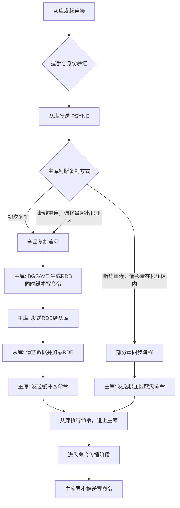
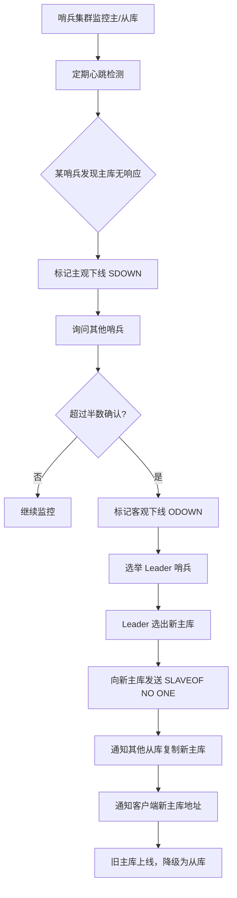
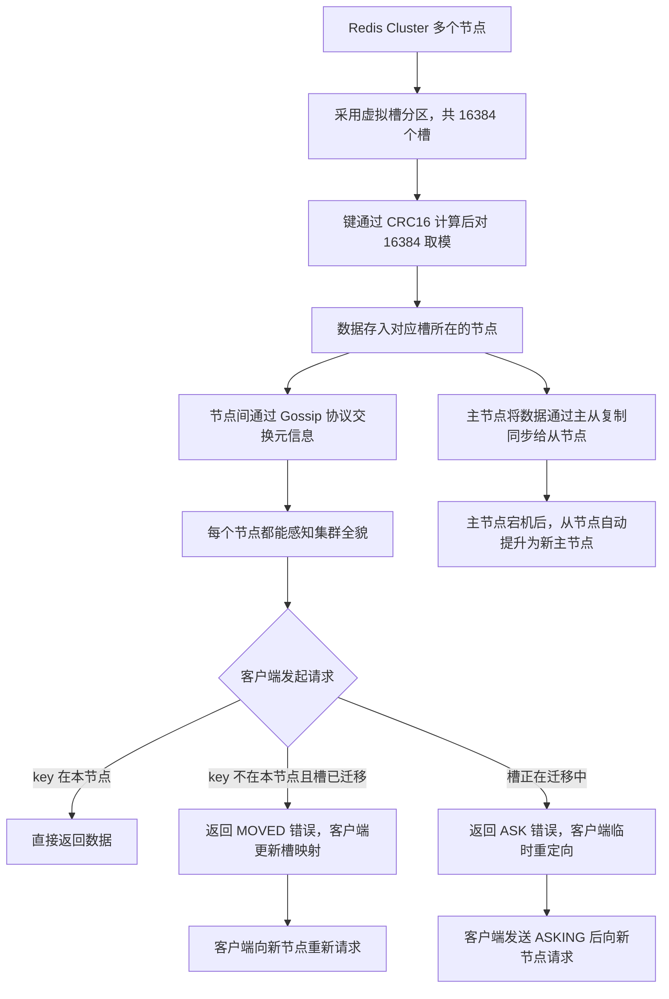

## 主从复制

### 一、握手阶段

-   **阶段名称**：握手通信
-   **发生时机**：主库与从库建立 TCP 连接后，正式复制开始前。
-   **目的**：完成身份与信息验证，为后续同步做准备。
-   **通信方式**：主库 ↔ 从库（双向，通过 `REPLCONF` 命令交互）。

**流程：**

1.  从库向主库发送 `REPLCONF listening-port <port>`，告知自己的监听端口。
2.  主库回复 `OK`。
3.  从库发送 `REPLCONF ip-address <ip>`，告知自己的 IP 地址。
4.  主库回复 `OK`。
5.  从库发送 `REPLCONF capa eof`（Redis 4.0+），告知主库自己支持无盘复制等能力。
6.  主库回复 `OK`。

> **注意**：如果主库设置了密码（`requirepass`），从库需提前配置 `masterauth`，并在握手期间通过 `AUTH` 命令认证。

### 二、PSYNC 同步命令

-   **命令名称**：`PSYNC`（Redis 2.8 之前是 `SYNC`）
-   **发送方向**：从库 → 主库
-   **触发时机**：握手完成后
-   **命令作用**：正式开启数据同步过程，根据情况触发全量复制或部分重同步
-   **命令格式**：
    -   **初次复制**：`PSYNC ? -1`
    -   **断线重连**：`PSYNC <主库运行ID> <复制偏移量>`

### 三、主库 Reply

-   **发送方向**：主库 → 从库
-   **触发条件**：主库收到 `PSYNC` 命令
-   **处理逻辑**：主库根据从库发来的运行ID和偏移量进行判断：
    1.  **运行ID与自身一致，且偏移量在复制积压缓冲区范围内** → 返回 `+CONTINUE`，触发**部分重同步（断线后重复制）**。
    2.  **运行ID不一致，或偏移量不在积压范围内** → 返回 `+FULLRESYNC <主库运行ID> <偏移量>`，触发**全量复制**。
-   **回复内容**：告知从库应执行的操作类型（全量复制/断线后重复制）。

### 四、全量复制（初次复制 / 完整重同步）

#### 步骤一：主库生成快照并缓冲写命令

-   主库执行 `BGSAVE`，fork 子进程生成当前数据的 RDB 文件。
-   同时，在 RDB 生成期间，主库将所有新收到的**写命令**记录到**复制缓冲区**中。

> **Redis 2.8.18+ 的无盘复制**：
> 若配置 `repl-diskless-sync yes`，主库不再生成 RDB 文件，而是 fork 子进程后直接将 RDB 数据流通过 Socket 发送给从库，省去磁盘 IO。

#### 步骤二：主库发送 RDB 文件给从库

-   RDB 文件生成完成后，主库将其发送给从库。

#### 步骤三：从库恢复数据

-   从库清空自身旧数据。
-   从库加载接收到的 RDB 文件，完成数据恢复。

> 之后，主库再将**复制缓冲区**中的写命令发送给从库，从库执行这些命令来补齐 RDB 生成期间的数据变化。

### 五、命令传播阶段

-   **触发条件**：全量复制或部分重同步完成后，进入稳态。
-   **目的**：持续保持主从数据一致。
-   **操作**：主库一旦执行写命令，会将该命令**异步**发送给所有从库，从库接收并执行相同命令。
-   **延迟**：由于异步，主从间存在一定延迟。

### 六、断线后重复制（部分重同步）

当主从连接断开后重连时，优先尝试部分重同步，避免全量复制开销。

#### 依赖的三个核心机制

| 机制 | 存储位置 | 作用说明 |
|------|----------|----------|
| **服务器运行ID** | 主库启动时生成，从库保存其主库的ID | 唯一标识一个主库实例；若主库重启，运行ID改变，从库需全量复制 |
| **复制偏移量** | 主从各自维护 | 主库每发送一个字节数据就增加偏移量；从库每接收一个字节就增加偏移量；用于判断主从同步进度 |
| **复制积压缓冲区** | 主库维护的定长 FIFO 队列（默认1MB） | 存储最近发送给从库的命令；若从库断线偏移量仍在此范围内，则直接发送缺失命令；**一旦缺失命令被挤出，则退化为全量复制** |

#### 断线重连流程

1.  从库重连主库，发送 `PSYNC <上次保存的主库运行ID> <自身偏移量>`。
2.  主库判断：
    -   **运行ID匹配 且 从库偏移量在积压区内** → 返回 `+CONTINUE`，只发送断线期间的命令。
    -   **否则** → 返回 `+FULLRESYNC`，触发全量复制。

### 全局流程图示

### 关键补充说明

1.  **主库重启问题**：主库重启后运行ID改变，所有从库发现运行ID不匹配，均会触发全量复制。因此生产中应尽量避免主库无故重启，或配合哨兵/集群自动故障转移。
2.  **复制积压缓冲区大小**：由 `repl-backlog-size` 参数控制，默认1MB。写入量大或断线恢复时间长的场景，建议适当调大，以支持部分重同步，避免频繁全量复制。
3.  **无盘复制**：通过 `repl-diskless-sync` 开启，适用于磁盘慢而网络快的场景（如机械盘、高并发写），但因使用子进程直接发送数据，会增加 CPU 和网络开销。
4.  **从库只读**：默认情况下，从库是只读的（`replica-read-only yes`），确保主从数据一致性。

---

## 哨兵机制

### 一、哨兵的核心概念

-   **核心功能**：新建哨兵组，对主库和从库进行统一监控；主库故障时，哨兵组投票选出新主库。
-   **本质**：从代码层面讲，哨兵是一个**不提供数据服务的特殊 Redis 服务器**。
-   **监控关系**：
    -   哨兵系统 → 主库（监控）
    -   哨兵系统 → 从库（监控，多个从库均被监控）
-   **复制关系**：从库之间以及从库与主库之间，通过**主从复制**机制保持数据同步。

> **补充**：哨兵通常采用**多节点部署**（推荐至少 3 个），它们之间也互相通信，共同构成哨兵集群，以防止单点故障。

### 二、监控与心跳机制

-   **集群规模示例**：1 主库 + 3 从库，哨兵系统统一监控这 4 台机器。
-   **心跳频率**：每个被监控的机器，每隔 **10 秒**（默认 `down-after-milliseconds`）向哨兵发送 PING 命令。
-   **断联判定**：若哨兵在指定时间内收不到有效心跳回复，即判定该机器**主观下线**。

> **补充**：这个时间阈值由 `down-after-milliseconds` 参数统一设定，通常为 30~60 秒。

### 三、下线判断逻辑

| 阶段 | 判断主体 | 说明 |
|------|----------|------|
| **主观下线 (SDOWN)** | 单个哨兵 | 某个哨兵发现主库在规定时间内无响应，即将其标注为“主观下线”，并通知其他哨兵。 |
| **客观下线 (ODOWN)** | 哨兵集群 | 通过命令 `SENTINEL is-master-down-by-addr` 进行确认。当超过**半数**哨兵都认为主库下线后，才标记为“客观下线”，触发故障转移。 |

> **关键参数**：
> -   **`quorum`**：用来设定“客观下线”所需的法定哨兵确认数。通常建议设为 `(哨兵总数/2) + 1`。

### 四、故障转移过程

1.  **选举 Leader 哨兵**
    通过 Raft 协议变体，在所有哨兵中选举出一个 **Leader**，负责主持整个故障转移流程。

2.  **选出新主库**
    Leader 哨兵根据一定规则（优先级、复制偏移量、运行ID等），从健康的从库中选出最合适的一个作为新主库。

3.  **晋升新主库**
    Leader 哨兵向选中的从库发送 `SLAVEOF NO ONE` 命令，使其升级为主库。

4.  **通知其他从库**
    向其余从库发送 `SLAVEOF <新主库IP> <新主库端口>`，让它们开始同步新主库。

5.  **更新客户端连接**
    哨兵通过 Pub/Sub 机制通知客户端新的主库地址，或由客户端主动询问哨兵获取。

### 五、旧主库重新上线的处理

-   若原来的故障主库重新上线，哨兵系统会立即检测到它。
-   哨兵会向它发送 `SLAVEOF <新主库IP> <新主库端口>`，将其**降级为从库**，从属于新的主库，不会再造成数据冲突。

### 六、全局流程图示

### 七、补充：哨兵与客户端交互

-   **服务发现**：客户端连接哨兵，通过 `SENTINEL get-master-addr-by-name` 命令获取当前主库地址。
-   **故障通知**：哨兵在完成故障转移后，会通过 `+switch-master` 频道发布通知，客户端可订阅这些频道来实时更新主库连接。

---

## 集群模式

### 一、Cluster 核心概念与能力

-   **定义**：Redis 提供的**分布式数据库解决方案**。
-   **核心能力**：
    -   **数据分片**：自动将数据**切分**给多个节点存储。
    -   **高可用**：即使部分节点宕机，仍可继续执行数据操作。

> **补充**：集群模式天然整合了**分片存储**与**主从复制**，每个分片（槽）都可以有一个主节点和多个从节点，以此同时解决大数据量存储和高可用问题。

### 二、分区策略：虚拟槽

**采用方式**：虚拟槽哈希分区。

**数据分配规则**：

-   所有键通过 **CRC16** 校验函数计算。
-   对 **16384** 取模，得出 `0~16383` 的槽位号。
-   每个 Redis Cluster 节点负责**一部分槽**的数据存储。

**高可用保障**：

-   节点可结合**主从复制模式**，将分配给它的数据进行复制，实现数据冗余。

### 总结：虚拟槽分区机制

| 要素 | 说明 |
|------|------|
| 槽总数 | **16384** 个 |
| 哈希函数 | **CRC16** |
| 槽位计算 | `CRC16(key) % 16384` |
| 节点职责 | 每个节点负责一部分槽 |
| 高可用保障 | 主从复制（每个槽的数据可在从节点备份） |

> **补充**：16384 这个数量是作者在心跳包大小和节点数之间做的折中；集群最大节点数建议不超过 1000。

### 三、元信息与节点通信

### 1. 节点存储的元信息
每个节点都会存储整个集群的**元信息**，包括该节点视角下的：

-   各节点存储的**槽数据**
-   各节点的 **master 和 slave 状态**
-   各节点**是否存活**
-   节点间拓扑关系等

### 2. 元数据传播：Gossip 协议

-   **传播方式**：Gossip 协议，每个节点将自己的数据信息通过该协议散布出去。
-   **传播特点**：
    -   **周期性执行**：每隔一定时间执行一次。
    -   **邻接传播**：所有节点选择 **k 个邻接节点**散布信息（通常为随机选择）。
-   **最终一致性**：通过周期性随机传播，最终整个集群所有节点都能获得完整的元信息视图。

### 四、Cluster 的扩容与缩容

-   **扩容场景**：数据太多，增加节点。
-   **缩容场景**：数据太少，减少节点避免浪费。
-   **核心影响**：数据会发生**迁移**（槽在节点间转移）。
-   **迁移中的特殊现象**：某个槽的一部分数据可能在原节点，另一部分已迁移到新节点。

### 查询逻辑流程（针对迁移中的请求）

> 客户端 → 指定节点发送查询命令
>
> 节点判断数据是否在本节点：
> -   **是** → 返回预期数据
> -   **否（且该槽正在迁移中）** → 发送 **ASK 错误**，告诉客户端新节点位置，客户端向新节点发送 `ASKING` 命令后重新请求。

> **补充区分**：
> -   **MOVED 错误**：槽已完全迁移到新节点，客户端需**永久更新**本地槽映射。
> -   **ASK 错误**：槽**正在迁移**，当前 key 已转移到新节点，属于临时重定向。

### 五、集群全局流程图示

### 六、补充：故障转移与主从切换

-   当某个主节点宕机后，集群中的其他主节点通过 Gossip 协议感知其故障。
-   超过半数主节点确认故障后，该主节点的从节点自动发起选举，产生新主节点。
-   新主节点接管原主节点的槽，过程与哨兵模式类似，但内置于集群中，无需额外组件。

